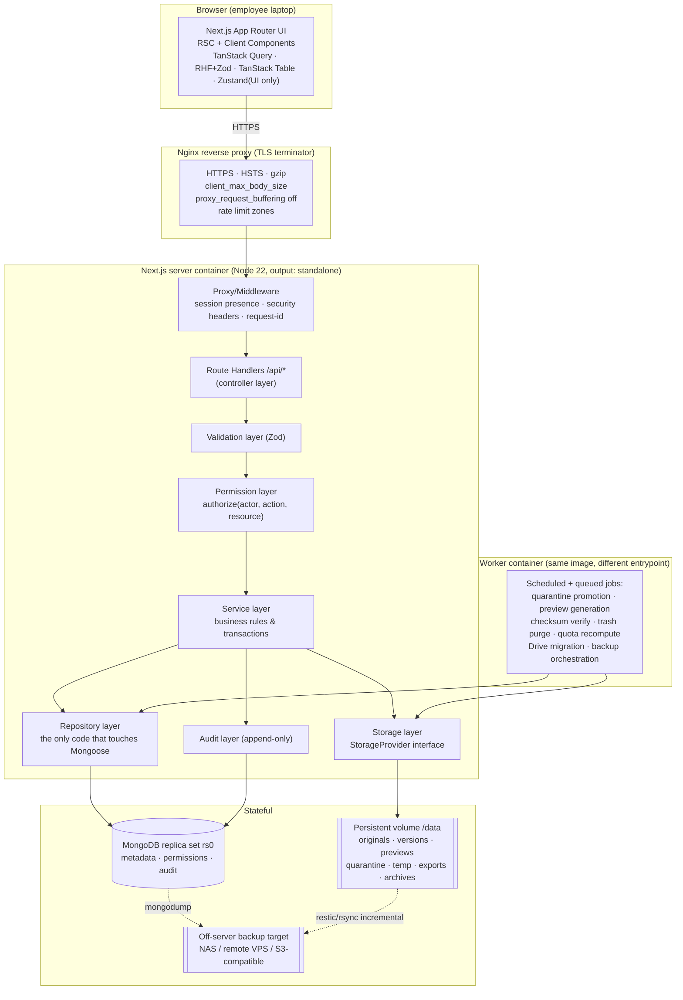
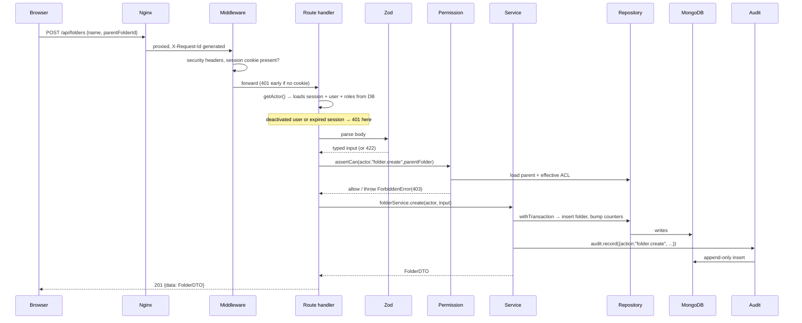

# 02 — System Architecture

## Runtime topology



## Layering rules

Requests flow **strictly downward**. A layer may call the layer below it and nothing above it.

| Layer | Location | Responsibility | Forbidden |
|---|---|---|---|
| **UI** | `src/app/**`, `src/components/**` | Rendering, local UI state, calling `/api/*` via TanStack Query | Importing Mongoose, `fs`, or anything under `src/server/db` / `src/server/storage`. Enforced by ESLint `no-restricted-imports`. |
| **Controller** | `src/app/api/**/route.ts` | Parse request, resolve actor, delegate, shape the HTTP response | Business rules, direct DB access, `fs` |
| **Validation** | `src/server/validation/**` | Zod schemas for every input & every output DTO | Anything else |
| **Permission** | `src/server/permissions/**` | `authorize()` / `assertCan()` / `visibilityFilter()` | Mutating data |
| **Service** | `src/server/services/**` | Business rules, orchestration, transactions, emits audit + notifications | Talking HTTP, importing React, raw Mongoose queries |
| **Repository** | `src/server/repositories/**` | The **only** place Mongoose models are queried; returns plain domain objects | Business rules, permission checks |
| **Storage** | `src/server/storage/**` | `StorageProvider` implementations; path safety | Knowing about users, permissions, or Mongo |
| **Audit** | `src/server/audit/**` | Append-only writes; never updates or deletes | Being skippable — services must call it |

### Why a repository layer at all?

Three concrete reasons, not ceremony:
1. **Permission filters must be applied at query time**, not after fetching. Repositories take a
   `VisibilityFilter` argument produced by the permission layer, so it is structurally hard to
   write a query that leaks. A leaked row in search is the #1 risk in this product.
2. **Soft delete** (`deletedAt: null`) must be applied by default on every read. One place to do it.
3. **NestJS extraction** — repositories and services move across unchanged; only controllers get rewritten.

### Path to NestJS (required by the brief)

Everything under `src/server/**` is framework-free TypeScript: no `next/*` imports, no `NextRequest`,
no React. Controllers translate HTTP↔domain at the boundary. Extraction becomes:

```
apps/web   (Next.js UI, calls apps/api over HTTP)
apps/api   (NestJS: controllers re-written; services/repositories/storage/audit copied verbatim)
packages/domain, packages/validation  (shared, unchanged)
```

Enforcement: an ESLint rule bans `next/*` imports inside `src/server/**`, and a unit test asserts
the ban. If the rule ever needs an exception, the extraction promise is already broken.

## Responsibility split

| Concern | Owner | Never |
|---|---|---|
| File bytes | Filesystem under `/data` (via `StorageProvider`) | Never in MongoDB. No Buffer field, no Base64, no GridFS. |
| File metadata, ACLs, versions, audit | MongoDB | Never on disk as the source of truth. |
| Mapping between the two | `FileVersion.storageKey` — an opaque, relative, provider-scoped key | The key is never an absolute path and is never returned to a client. |
| Sessions | MongoDB `sessions` collection + HTTP-only cookie holding an opaque id | Never a self-contained JWT — revocation must be instant (brief §5). |
| Derived state (folder size, quota usage) | MongoDB, recomputed by worker + incrementally maintained | Never trusted from the client. |

**The invariant that makes this system safe:** *no HTTP response body or header ever contains a
filesystem path, and no route serves bytes without first calling `assertCan()`.*

## Request lifecycle (a representative mutation)



Failure at any step produces a typed `AppError` → uniform JSON envelope. `403` and `404` are
deliberately **merged for records the actor cannot see** — a 403 on an unknown id confirms the id
exists (see [08](./08-security-threat-model.md)).

## API conventions

- Envelope: `{ "data": … }` on success, `{ "error": { code, message, details?, requestId } }` on failure.
- `code` is a stable machine string (`FORBIDDEN`, `NOT_FOUND`, `VALIDATION_FAILED`, `QUOTA_EXCEEDED`, `FILE_LOCKED_APPROVED`, `UPLOAD_SESSION_EXPIRED`, …).
- Pagination: cursor-based (`?cursor=&limit=`) for infinite lists, `?page=&pageSize=` for tables; both capped at 100.
- Every response carries `X-Request-Id`, echoed into audit rows and logs.
- All mutating routes require a CSRF token (double-submit) unless authenticated by `Authorization: Bearer` (not used in MVP).
- Binary routes (`/preview`, `/download`) are the only ones that do not return JSON.

## Source layout (created in Phase 1)

```
src/
├── app/
│   ├── (auth)/login, /forgot-password
│   ├── (drive)/                    # authenticated shell: sidebar + header
│   │   ├── home, my-drive, departments/[id], projects/[id]
│   │   ├── folders/[folderId], files/[fileId]
│   │   ├── shared, recent, starred, reviews, approved, archive, trash, search
│   ├── (admin)/admin/{users,departments,projects,roles,templates,storage,audit,backups,migrations,settings}
│   └── api/…                       # controllers only
├── components/{ui,drive,upload,preview,review,admin,layout}
├── hooks/                          # TanStack Query hooks — the only place fetch() is called
├── lib/                            # isomorphic helpers (formatting, mime maps, constants)
├── server/
│   ├── audit/  config/  db/  errors/  logging/  permissions/
│   ├── repositories/  services/  storage/  validation/  jobs/  auth/
└── types/
docs/  docker/  scripts/  tests/{unit,integration,e2e,security}
```

## Cross-cutting concerns

**Configuration** — `src/server/config/env.ts` parses `process.env` with Zod **once at boot**;
invalid config crashes the process rather than degrading. Client-visible values are a separate,
explicitly whitelisted `publicEnv`.

**Errors** — `AppError` hierarchy (`ValidationError`, `UnauthorizedError`, `ForbiddenError`,
`NotFoundError`, `ConflictError`, `QuotaExceededError`, `StorageError`, `RateLimitError`). A single
`withRouteHandler()` wrapper catches, logs with request id, maps to status, and — critically —
never leaks `err.message` from unknown errors to the client.

**Logging** — Pino, JSON to stdout, redacting `password`, `token`, `cookie`, `authorization`,
`storageKey`, `absolutePath`. Docker collects; no log file on the app volume.

**Jobs** — MVP uses an in-process scheduler in the worker container reading a `jobs` collection with
atomic `findOneAndUpdate` claim + lease. No Redis dependency in the MVP; the interface allows BullMQ later.

**Transactions** — `withTransaction()` helper used wherever two collections must agree:
upload finalization (file + version + quota + audit), version restore, folder move, approval,
migration item import. Requires a replica set (assumption A7).
