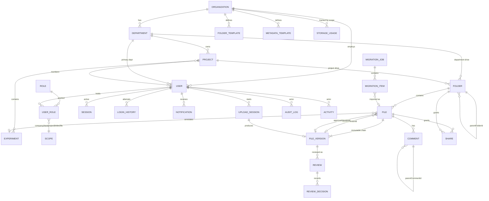

# 03 — MongoDB Data Model, Collections & Indexes

MongoDB holds **metadata, permissions and history only**. No collection contains file bytes,
Base64, or GridFS references. The single link to physical storage is `fileVersions.storageKey`,
an opaque relative key interpreted only by the `StorageProvider`.

## ER-style collection diagram



**24 collections:** `organizations`, `users`, `departments`, `projects`, `experiments`, `roles`,
`userRoles`, `sessions`, `loginHistory`, `folders`, `files`, `fileVersions`, `shares`, `comments`,
`reviews`, `notifications`, `uploadSessions`, `migrationJobs`, `migrationItems`, `auditLogs`,
`activities`, `folderTemplates`, `metadataTemplates`, `storageUsage` (+ `jobs`, `settings` for infra).

## Conventions

- `_id`: `ObjectId`. All references are `ObjectId` with an explicit `ref`.
- Timestamps: Mongoose `{ timestamps: true }` → `createdAt` / `updatedAt`, UTC.
- Soft delete: `deletedAt: Date | null`, `deletedBy`. Repositories inject `deletedAt: null` by default.
- Enums are TypeScript `as const` unions shared with Zod — one definition, three uses (TS type, Zod schema, Mongoose enum).
- `organizationId` is on every tenant-scoped document (assumption A1) and is a prefix on compound indexes.
- **Never** store absolute paths. `storageKey` is relative to a provider root.

---

## Identity & organization

### `organizations`
| Field | Type | Notes |
|---|---|---|
| `_id` | ObjectId | |
| `name`, `slug` | string | slug unique |
| `emailDomains` | string[] | mirrors `COMPANY_EMAIL_DOMAINS`, DB wins at runtime |
| `settings` | object | `{ allowAutoProvisioning, defaultUserQuotaBytes, defaultDepartmentQuotaBytes, maxUploadBytes, allowedExtensions[], blockedExtensions[], trashRetentionDays, requireApprovalForCategories[] }` |
| `storageUsedBytes` | number | maintained incrementally |

### `users`
| Field | Type | Notes |
|---|---|---|
| `organizationId` | ObjectId | |
| `email` | string | **unique, lowercased**, domain-validated |
| `emailDomain` | string | denormalized for fast filtering |
| `name`, `avatarUrl`, `jobTitle`, `phone` | string? | |
| `authProviders` | array | `[{ provider: 'google'\|'microsoft'\|'password', providerAccountId?, linkedAt }]` |
| `passwordHash` | string? | **Argon2id**; `select: false` — never returned by default |
| `passwordUpdatedAt`, `mustChangePassword` | Date / bool | |
| `mfa` | object? | `{ enabled, secret(select:false), backupCodes[](hashed), verifiedAt }` |
| `status` | enum | `invited` · `active` · `suspended` · `deactivated` |
| `departmentId` | ObjectId? | primary department (A4) |
| `projectIds` | ObjectId[] | denormalized membership for fast visibility filters |
| `isSuperAdmin` | boolean | break-glass; separate from role grants |
| `storageQuotaBytes`, `storageUsedBytes` | number | |
| `lastLoginAt`, `lastActiveAt` | Date? | |
| `failedLoginCount`, `lockedUntil` | number / Date? | lockout state |
| `preferences` | object | `{ theme: 'system'\|'light'\|'dark', defaultView: 'list'\|'grid', density }` |
| `deactivatedAt`, `deactivatedBy`, `deactivationReason` | | |

> `status !== 'active'` is checked on **every** authenticated request, not only at login — this is
> what makes deactivation immediate (brief §5, tested in Phase 2).

### `departments`
`organizationId`, `name`, `code` (unique per org), `description`, `headUserId`, `parentDepartmentId?`,
`rootFolderId`, `storageQuotaBytes`, `storageUsedBytes`, `memberCount`, `isActive`, soft-delete fields.

### `projects`
`organizationId`, `departmentId`, `name`, `code` (unique per org, e.g. `EXR-2026-014`), `description`,
`status` (`planning|active|on_hold|completed|archived`), `leadUserId`, `members[{userId, projectRole, addedAt, addedBy}]`,
`rootFolderId`, `startDate`, `endDate`, `tags[]`, `folderTemplateId`, `metadataTemplateId`,
`confidentiality` (`public_internal|internal|confidential|restricted`), `storageUsedBytes`, `fileCount`, soft-delete.

### `experiments`
`organizationId`, `projectId`, `code` (unique per project, e.g. `EXP-014-021`), `title`, `objective`,
`experimentType`, `status` (`planned|in_progress|completed|failed|aborted`), `leadUserId`, `researcherIds[]`,
`startDate`, `endDate`, `protocolRefs[]`, `instrumentRefs[]`, `sampleIds[]`, `organism`, `batchLot`,
`resultSummary`, `tags[]`, `folderId?`, soft-delete.

> Experiments are deliberately thin. They exist to *group and find files*, not to model laboratory
> execution. Anything more is the LIMS the brief forbids.

### `roles` and `userRoles`

Roles are data, not code, so admins can add roles without a deploy.

```
roles: {
  organizationId, key, name, description,
  permissions: PermissionKey[],       // from the 22 in §05
  scopeTypes: ScopeType[],            // where this role may be granted
  isSystem: boolean,                  // system roles cannot be deleted
  rank: number                        // for "cannot grant above yourself"
}

userRoles: {
  organizationId, userId, roleId,
  scopeType: 'company'|'department'|'project'|'folder'|'file',
  scopeId: ObjectId | null,           // null only when scopeType='company'
  grantedBy, grantedAt, expiresAt?, revokedAt?
}
```

Default system roles seeded in Phase 2: Super Admin, Company Admin, R&D Head, Department Head,
Project Lead, Research Scientist, Lab Technician, Data Analyst, Reviewer, Management Viewer.

### `sessions`
`userId`, `tokenHash` (SHA-256 of the opaque cookie value — the raw value is never stored),
`csrfTokenHash`, `createdAt`, `lastUsedAt`, `expiresAt`, `absoluteExpiresAt`, `rotatedFrom?`,
`ip`, `userAgent`, `deviceLabel`, `revokedAt?`, `revokedReason?`.

### `loginHistory`
`userId?` (null for unknown email), `email`, `outcome`
(`success|bad_password|unknown_user|domain_rejected|deactivated|locked|mfa_failed|rate_limited`),
`ip`, `userAgent`, `provider`, `createdAt`. TTL-expired after 400 days.

---

## Drive core

### `folders`
| Field | Type | Notes |
|---|---|---|
| `organizationId`, `name` | | name unique per `(parentFolderId, deletedAt:null)` — case-insensitive collation |
| `parentFolderId` | ObjectId? | `null` = drive root |
| `driveType` | enum | `my_drive` · `department` · `project` · `system` |
| `ownerId`, `departmentId?`, `projectId?` | ObjectId | |
| `pathAncestors` | ObjectId[] | **ordered root→parent**; the backbone of subtree queries |
| `depth` | number | `pathAncestors.length`; capped at 32 |
| `displayPath` | string | cached, **for display only**, never used for lookup or file resolution |
| `templateKey` | string? | e.g. `06_Raw Data` when generated from a template |
| `isStarredBy` | ObjectId[] | star is per-user, so it is a set of user ids |
| `status` | enum | `active` · `archived` · `trashed` |
| `permissions` | array | direct grants: `[{ principalType:'user'\|'department'\|'project'\|'role', principalId, accessLevel, grantedBy, grantedAt, expiresAt? }]` |
| `inheritPermissions` | boolean | default `true`; `false` breaks inheritance at this node |
| `inheritedPermissionsVersion` | number | bumped on ACL change to invalidate caches |
| `fileCount`, `subfolderCount`, `sizeBytes` | number | maintained by worker |
| `createdBy`, `deletedAt`, `deletedBy`, `trashedFromParentId` | | restore needs the original parent |

**Hierarchy is `parentFolderId` + `pathAncestors`, never a text path** (brief §9). Moving a folder
rewrites `pathAncestors` for the subtree in one `updateMany` with `$set` on a computed slice.

### `files` (the *logical* document)
| Field | Type | Notes |
|---|---|---|
| `organizationId`, `folderId`, `ownerId` | | |
| `displayName` | string | user-editable |
| `originalFilename` | string | as first uploaded, immutable |
| `extension`, `mimeType`, `sizeBytes` | | mirrored from the current version for list rendering & sorting |
| `departmentId?`, `projectId?`, `experimentId?` | | |
| `currentVersionId`, `approvedVersionId` | ObjectId? | |
| `versionCount` | number | |
| `category` | enum | `protocol · sop · raw_data · processed_data · analysis · result · report · presentation · publication · regulatory · image · sequence · spectrum · other` |
| `documentType`, `dataType` | string? | free-ish, template-driven |
| `tags` | string[] | lowercased, deduped |
| `confidentiality` | enum | `public_internal · internal · confidential · restricted` |
| `research` | object | `{ studyId?, sampleIds[], protocolRef?, instrumentRef?, organism?, batchLot?, researchDate?, researcherIds[], resultSummary?, custom: Record<string,string\|number\|Date> }` |
| `metadataTemplateId` | ObjectId? | |
| `reviewStatus` | enum | `draft · submitted · in_review · changes_requested · approved · rejected` |
| `approvalStatus` | enum | `none · pending · approved · rejected` |
| `lifecycle` | enum | `draft · final · superseded · archived` |
| `isLocked` | boolean | true once approved; new versions still allowed, mutation of the approved version is not |
| `permissions`, `inheritPermissions` | | same shape as folders — file-level override |
| `isStarredBy` | ObjectId[] | |
| `status` | enum | `active · archived · trashed` |
| `searchText` | string | denormalized concat of name/tags/sample ids/etc. for the text index |
| `lastAccessedAt`, `viewCount`, `downloadCount` | | |
| `checksumOfCurrent` | string | fast duplicate detection in a folder |
| `sourceDriveId`, `migrationJobId` | string?/ObjectId? | Google Drive provenance |
| `createdBy`, `deletedAt`, `deletedBy`, `trashedFromFolderId` | | |

### `fileVersions` (immutable)
| Field | Type | Notes |
|---|---|---|
| `fileId`, `organizationId` | | |
| `versionNumber` | number | 1-based, monotonic, unique per file |
| `storageKey` | string | opaque relative key, e.g. `originals/<org>/<dept>/<fileId>/<versionId>` |
| `relativeStoragePath` | string | same value, kept because the brief names both; `storageKey` is canonical |
| `storageProvider` | enum | `local` (future: `s3`, `minio`, `r2`) |
| `originalFilename`, `storedFilename` | string | stored name is UUID-based |
| `fileSize`, `mimeType`, `declaredMimeType`, `extension` | | `declaredMimeType` = what the client claimed; `mimeType` = what sniffing found |
| `checksum` | string | `sha256:<hex>` |
| `uploadedBy`, `uploadedAt` | | |
| `versionNote` | string? | |
| `processingStatus` | enum | `pending · uploading · processing · quarantined · ready · failed · rejected · archived` |
| `scanStatus`, `scanResult`, `scannedAt` | | ClamAV hook (Phase 11) |
| `reviewStatus`, `approvalStatus` | enum | per-version |
| `versionLabel` | enum | `draft · under_review · changes_requested · approved · final · superseded · archived` |
| `isCurrent`, `isApproved` | boolean | **at most one `true` of each per file** — enforced by partial unique indexes |
| `previewStatus`, `previewKey`, `previewMimeType` | | generated artifact, may be null |
| `restoredFromVersionId` | ObjectId? | set when created by "restore an old version" |
| `uploadSessionId` | ObjectId? | idempotent finalization link |
| `deletedAt` | Date? | only ever set by hard-purge of a trashed file |

**Immutability rule:** after `processingStatus === 'ready'`, only `reviewStatus`, `approvalStatus`,
`versionLabel`, `isCurrent`, `isApproved`, `previewStatus/previewKey`, `scanStatus` may change.
A Mongoose `pre('save')` guard rejects edits to any other field on a ready version.

### `uploadSessions`
`organizationId`, `userId`, `folderId`, `intent` (`new_file|new_version`), `targetFileId?`,
`declaredFilename`, `declaredSize`, `declaredMimeType`, `sanitizedFilename`, `extension`,
`uploadType` (`single|chunked`), `chunkSize`, `totalChunks`, `receivedChunks[]`, `bytesReceived`,
`quarantineKey`, `status` (`pending|uploading|processing|quarantined|ready|failed|rejected|expired`),
`checksum?`, `clientChecksum?`, `idempotencyKey` (unique), `resultFileId?`, `resultVersionId?`,
`error?`, `expiresAt` (TTL), `createdAt`.

Finalization is idempotent: it is a transaction keyed on `idempotencyKey`; a second call returns
the already-created `{fileId, versionId}` instead of creating a duplicate.

---

## Collaboration & governance

### `shares`
`organizationId`, `resourceType` (`file|folder`), `resourceId`, `principalType`
(`user|department|project|role`), `principalId`, `accessLevel`
(`viewer|commenter|editor|reviewer|approver|manager`), `grantedBy`, `grantedAt`, `expiresAt?`,
`revokedAt?`, `revokedBy?`, `message?`.
Unique on `(resourceType, resourceId, principalType, principalId, revokedAt:null)`.

> Shares are stored **both** denormalized on the folder/file (`permissions[]`, for single-document
> permission resolution) **and** in `shares` (for "shared with me" queries and share history).
> The service layer writes both inside one transaction. This duplication is deliberate: it removes
> a `$lookup` from the hottest path in the app.

### `comments`
`organizationId`, `fileId`, `versionId?`, `parentCommentId?`, `authorId`, `body`, `mentions[userId]`,
`isResolved`, `resolvedBy`, `resolvedAt`, `editedAt`, soft-delete. Comments never mutate file data.

### `reviews`
`organizationId`, `fileId`, `versionId` (**required — a review is always of one exact version**),
`requestedBy`, `requestedAt`, `reviewerIds[]`, `requiredApprovals` (default 1), `dueDate?`,
`status` (`pending|in_review|changes_requested|approved|rejected|cancelled`),
`decisions[{ reviewerId, decision: 'approved'|'rejected'|'changes_requested', note, decidedAt, ip, userAgent }]`,
`completedAt`, `note`.

### `notifications`
`userId`, `type`, `title`, `body`, `resourceType`, `resourceId`, `actorId`, `isRead`, `readAt`,
`emailSentAt?`, `createdAt`. **Generated only after a permission check** — a notification must never
reveal a resource the recipient cannot see.

### `auditLogs` (append-only)
`organizationId`, `actorUserId`, `actorEmail`, `actorRoleKeys[]`, `action` (from a closed enum of the
24 in brief §16 + sub-actions), `entityType`, `entityId`, `entityLabel`,
`previousValue?`, `newValue?` (redacted, size-capped at 16 KB), `reason?` (required for sensitive
actions), `ip`, `userAgent`, `requestId`, `outcome` (`success|denied|error`), `severity`, `createdAt`.

Enforcement: the Mongoose model registers no update/delete methods, the audit repository exposes
only `append()` and `query()`, and the production DB user has `insert`+`find` on this collection
only. Retention 7 years; never TTL'd by default.

### `activities`
User-facing timeline (lighter, prunable, TTL 400 days): `organizationId`, `actorId`, `verb`,
`resourceType`, `resourceId`, `folderId`, `metadata`, `createdAt`. Audit is for compliance;
activity is for the "Activity" panel. They are separate on purpose — one is trimmed, one is not.

### `folderTemplates` / `metadataTemplates`
```
folderTemplates:   { organizationId, name, appliesTo:'project'|'department'|'experiment',
                     nodes:[{ key:'06_Raw Data', name, children:[…], defaultCategory?, description? }],
                     isDefault, isSystem, createdBy }
metadataTemplates: { organizationId, name, appliesTo:{ departmentIds[], categories[], projectTypes[], experimentTypes[], mimeGroups[] },
                     fields:[{ key,label,type:'text'|'number'|'date'|'select'|'multiselect'|'boolean',
                               required, options[], helpText, pattern? }],
                     isDefault, isSystem }
```
Default folder template seeds the 12 prescribed project folders (`01_Project Overview` … `12_Archived Files`).

### `storageUsage`
`organizationId`, `scopeType` (`user|department|project|folder|organization`), `scopeId`,
`bytesUsed`, `fileCount`, `versionCount`, `quotaBytes`, `computedAt`. Incrementally updated in the
upload/delete transactions and reconciled nightly by the worker.

### `migrationJobs` / `migrationItems`
See [10 — Google Drive Migration](./10-google-drive-migration.md) for full field lists and state machine.

---

## Indexing strategy

Guiding rules: (1) every list screen must be served by one index, (2) permission-visibility fields
lead compound indexes so filtered queries stay covered, (3) text search is one index per collection
(Mongo's limit) with weights, (4) partial indexes enforce the "exactly one current/approved version"
invariant in the database, not just in code.

### `users`
```js
{ email: 1 }                                   // unique
{ organizationId: 1, status: 1, departmentId: 1 }
{ organizationId: 1, projectIds: 1 }
{ name: 'text', email: 'text' }                // admin user search
{ lockedUntil: 1 }                             // sparse
```

### `sessions`
```js
{ tokenHash: 1 }                               // unique — the auth hot path
{ userId: 1, revokedAt: 1, expiresAt: -1 }     // "log out everywhere", device list
{ expiresAt: 1 }                               // TTL expireAfterSeconds: 0
```

### `folders`
```js
{ organizationId: 1, parentFolderId: 1, deletedAt: 1, name: 1 }   // folder listing + unique-name check
{ organizationId: 1, pathAncestors: 1, deletedAt: 1 }             // subtree ops, breadcrumb, cascade
{ organizationId: 1, driveType: 1, departmentId: 1, deletedAt: 1 }
{ organizationId: 1, driveType: 1, projectId: 1, deletedAt: 1 }
{ organizationId: 1, ownerId: 1, driveType: 1, deletedAt: 1 }     // My Drive
{ 'permissions.principalId': 1, deletedAt: 1 }                    // shared-with-me
{ organizationId: 1, status: 1, deletedAt: 1 }                    // trash / archive
{ name: 'text' }
// unique name per parent, ignoring trashed:
{ parentFolderId: 1, name: 1 } unique, partial: { deletedAt: null }, collation strength 2
```

### `files` — the busiest collection
```js
{ organizationId: 1, folderId: 1, deletedAt: 1, updatedAt: -1 }   // folder contents (default sort)
{ organizationId: 1, folderId: 1, deletedAt: 1, displayName: 1 }  // name sort
{ organizationId: 1, ownerId: 1, deletedAt: 1, updatedAt: -1 }
{ organizationId: 1, projectId: 1, deletedAt: 1, updatedAt: -1 }
{ organizationId: 1, experimentId: 1, deletedAt: 1 }
{ organizationId: 1, departmentId: 1, confidentiality: 1, deletedAt: 1 }
{ organizationId: 1, reviewStatus: 1, updatedAt: -1 }             // Pending Reviews
{ organizationId: 1, approvalStatus: 1, updatedAt: -1 }           // Approved Files
{ organizationId: 1, 'research.sampleIds': 1 }
{ organizationId: 1, tags: 1 }
{ organizationId: 1, category: 1, deletedAt: 1 }
{ organizationId: 1, isStarredBy: 1, deletedAt: 1 }
{ organizationId: 1, lastAccessedAt: -1 }                         // Recent
{ 'permissions.principalId': 1, deletedAt: 1 }                    // Shared with me
{ organizationId: 1, status: 1, deletedAt: -1 }                   // Trash, purge job
{ organizationId: 1, checksumOfCurrent: 1 }                       // duplicate detection
{ organizationId: 1, sourceDriveId: 1 } sparse unique             // migration idempotency
// text index (one per collection) with weights:
{ displayName:'text', originalFilename:'text', searchText:'text', tags:'text' }
   weights { displayName: 10, originalFilename: 6, tags: 5, searchText: 1 }
```

### `fileVersions`
```js
{ fileId: 1, versionNumber: -1 }                                  // unique — version history
{ fileId: 1, isCurrent: 1 } unique, partial: { isCurrent: true }   // ← invariant: one current
{ fileId: 1, isApproved: 1 } unique, partial: { isApproved: true } // ← invariant: one approved
{ storageKey: 1 } unique                                          // no two versions share bytes-location
{ checksum: 1, organizationId: 1 }                                // dedupe / integrity sweep
{ processingStatus: 1, createdAt: 1 }                             // worker queues, stuck-upload sweep
{ uploadSessionId: 1 } sparse unique                              // idempotent finalize
```

### `uploadSessions`
```js
{ idempotencyKey: 1 } unique
{ userId: 1, status: 1, createdAt: -1 }
{ expiresAt: 1 }              // TTL — cleans abandoned uploads (INCOMPLETE_UPLOAD_RETENTION_HOURS)
{ status: 1, updatedAt: 1 }   // stuck-session sweeper
```

### `shares`, `comments`, `reviews`, `notifications`
```js
shares:        { resourceType:1, resourceId:1, revokedAt:1 }
               { principalType:1, principalId:1, revokedAt:1, grantedAt:-1 }
               { resourceType:1, resourceId:1, principalType:1, principalId:1 } unique partial {revokedAt:null}
               { expiresAt: 1 } sparse
comments:      { fileId:1, createdAt:-1 }   { parentCommentId:1 }   { mentions:1, createdAt:-1 }
reviews:       { fileId:1, createdAt:-1 }   { reviewerIds:1, status:1, createdAt:-1 }  // reviewer inbox
               { versionId:1 }              { organizationId:1, status:1, dueDate:1 }
notifications: { userId:1, isRead:1, createdAt:-1 }   { createdAt:1 } TTL 180d
```

### `auditLogs`
```js
{ organizationId:1, createdAt:-1 }
{ actorUserId:1, createdAt:-1 }
{ entityType:1, entityId:1, createdAt:-1 }     // "history of this file"
{ action:1, createdAt:-1 }
{ requestId:1 }
{ outcome:1, createdAt:-1 }                    // denied-access review
// NO TTL. Retention is enforced by an explicit, audited archival job.
```

### `activities`, `storageUsage`, `experiments`, `projects`
```js
activities:   { organizationId:1, createdAt:-1 }  { resourceType:1, resourceId:1, createdAt:-1 }
              { actorId:1, createdAt:-1 }         { createdAt:1 } TTL 400d
storageUsage: { scopeType:1, scopeId:1 } unique
experiments:  { projectId:1, code:1 } unique   { organizationId:1, status:1 }
              { code:'text', title:'text', tags:'text' }
projects:     { organizationId:1, code:1 } unique   { organizationId:1, status:1, departmentId:1 }
              { 'members.userId':1 }   { name:'text', code:'text', tags:'text' }
```

## Transaction boundaries

| Operation | Documents that must agree |
|---|---|
| Finalize upload (new file) | `files` insert + `fileVersions` insert + `uploadSessions` update + `storageUsage` inc + `auditLogs` append |
| Finalize upload (new version) | `fileVersions` insert + previous `isCurrent:false` + `files.currentVersionId` + quota + audit |
| Restore old version | new `fileVersions` row (copy of bytes key or re-point) + `isCurrent` flip + audit |
| Approve version | `reviews` decision + `fileVersions.isApproved/versionLabel` + `files.approvedVersionId/isLocked` + audit |
| Move folder | `folders` parent + subtree `pathAncestors` rewrite + audit |
| Delete (trash) folder | subtree `folders` + `files` status flip + audit |
| Share / revoke | `shares` + denormalized `permissions[]` on the resource + `inheritedPermissionsVersion` bump + audit |
| Migration item import | `files` + `fileVersions` + `migrationItems` + audit |

All wrapped in `withTransaction()` with retry on `TransientTransactionError`.
