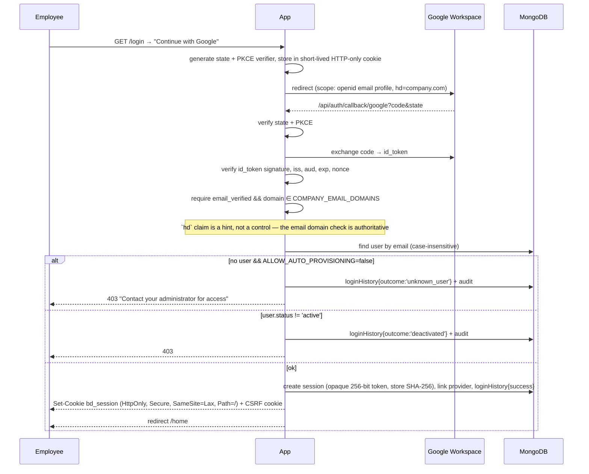

# 05 — Authentication Flow & Permission Model

Two separate questions, deliberately never conflated:

> **Authentication** — *may this person sign in?* → decided by company email domain + account status.
> **Authorization** — *what may this account touch?* → decided by role grants and resource ACLs in MongoDB.

Owning a `@company.com` address grants **sign-in eligibility only**, and only when
`ALLOW_AUTO_PROVISIONING=true`. With the default `false`, an admin must create/invite the account first.

## Authentication flows

### Google Workspace OAuth (primary)



Microsoft Entra ID is the same flow with tenant-restricted authority and the same authoritative
email-domain check.

### Email + password (fallback for staff without Workspace accounts)

```mermaid
sequenceDiagram
    participant U as Employee
    participant A as App
    participant DB as MongoDB
    U->>A: POST /api/auth/login {email, password, csrf}
    A->>A: rate-limit by IP (10/15min) and by email (5/15min)
    A->>A: reject non-company domain (constant-time-ish, generic error)
    A->>DB: load user +passwordHash +mfa
    A->>A: argon2.verify — ALWAYS run a dummy verify when the user is absent
    Note over A: identical latency and identical error text for<br/>unknown user / wrong password / wrong domain
    alt fail
        A->>DB: failedLoginCount++ ; lockedUntil after 5 (exponential 15m→24h)
        A->>DB: loginHistory + audit(auth.login_failed)
        A-->>U: 401 INVALID_CREDENTIALS
    else ok && mfa.enabled
        A-->>U: 200 {mfaRequired:true, challengeId}  (no session yet)
    else ok
        A->>DB: reset counters, create session, loginHistory, audit
        A-->>U: Set-Cookie + 200
    end
```

### Session management

| Property | Value |
|---|---|
| Token | 32 random bytes, base64url; **only** `sha256(token)` is stored |
| Cookie | `bd_session`; `HttpOnly`, `Secure` (prod), `SameSite=Lax`, `Path=/`, no `Domain` |
| Idle expiry | 8 h (`expiresAt`, extended on use, at most once per 5 min) |
| Absolute expiry | 12 h (`absoluteExpiresAt`, never extended) |
| Rotation | New token on login, on privilege change, and every 30 min of activity; old row keeps `rotatedFrom` for 60 s to survive concurrent requests |
| Revocation | `revokedAt` set → the very next request fails. Triggered by logout, "sign out everywhere", deactivation, role change, password reset |
| Storage | `sessions` collection + TTL index — expiry is enforced by the DB as well as by code |
| CSRF | Double-submit: `bd_csrf` (readable) + `X-CSRF-Token` header compared to `csrfTokenHash` on the session. Required for every non-GET, plus `Origin`/`Sec-Fetch-Site` checks |

**Why server-side sessions and not JWTs:** the brief requires deactivated users to lose access
*immediately*. A stateless JWT cannot be revoked before expiry without a server-side denylist —
which is a session table with extra steps.

### `getActor()` — run on every authenticated request

```
cookie → sha256 → sessions.findOne({tokenHash, revokedAt:null, expiresAt:{$gt:now}})
  → users.findOne({_id, deletedAt:null})
  → assert user.status === 'active'                       ← immediate deactivation
  → assert user.passwordUpdatedAt <= session.createdAt    ← password change kills old sessions
  → load role grants (userRoles, unexpired, unrevoked)
  → return Actor { userId, email, organizationId, departmentId, projectIds[], roles[], permissions:Set, isSuperAdmin }
```

Actor assembly is cached in-request only (never across requests) so permission changes take effect
on the next request — satisfying "permission changes should take effect immediately" (brief §14).

### Password policy & reset

Argon2id (`m=64MiB, t=3, p=1`), min 12 chars, checked against a common-password list and against the
user's own name/email. Reset: single-use token (`sha256` stored, 30 min TTL), always responds
"if that address exists we've sent a link", revokes all sessions on success, audited.

### Rate limits (in-process token bucket in MVP; Redis-ready interface)

| Endpoint | Limit |
|---|---|
| `POST /api/auth/login` | 10 / 15 min / IP · 5 / 15 min / email |
| `POST /api/auth/forgot-password` | 3 / hour / email · 10 / hour / IP |
| `POST /api/uploads/*` | 60 / min / user |
| `GET /api/files/*/download` | 300 / hour / user |
| `GET /api/search` | 120 / min / user |
| Global authenticated | 1000 / 15 min / user |

## Authorization model

Three inputs combine:

1. **Role grants** (`userRoles`) — a role at a scope: company / department / project / folder / file.
2. **Resource ACLs** — `permissions[]` on the folder or file, with folder→child inheritance.
3. **Attributes** — `confidentiality` on the file, plus ownership.

### The 22 permissions

`file.view` · `file.preview` · `file.upload` · `file.download` · `folder.create` · `resource.rename` ·
`resource.move` · `resource.copy` · `comment.create` · `share.internal` · `metadata.edit` ·
`version.upload` · `review.submit` · `review.perform` · `review.approve` · `resource.archive` ·
`resource.restore` · `resource.delete` · `resource.export` · `access.manage` · `user.manage` · `audit.view`

### Access levels → permissions

| Level | Grants |
|---|---|
| **Viewer** | view, preview, download |
| **Commenter** | Viewer + comment.create |
| **Editor** | Commenter + upload, folder.create, rename, move, copy, metadata.edit, version.upload, review.submit |
| **Reviewer** | Commenter + review.perform |
| **Approver** | Reviewer + review.approve |
| **Manager** | Editor + Approver + share.internal, access.manage, archive, restore, delete, export |

### Role → permission matrix

Legend: **C** company-wide · **D** own department · **P** projects you belong to · **O** own content ·
**S** explicitly shared with you · — none

| Permission | Super Admin | Company Admin | R&D Head | Dept Head | Project Lead | Research Scientist | Lab Technician | Data Analyst | Reviewer | Mgmt Viewer |
|---|---|---|---|---|---|---|---|---|---|---|
| file.view | C | C | C | D | P | P+O+S | P+O+S | P+O+S | S | C¹ |
| file.preview | C | C | C | D | P | P+O+S | P+O+S | P+O+S | S | C¹ |
| file.download | C | C | C | D | P | P+O+S | P+O+S | P+O+S | S | — |
| file.upload | C | C | C | D | P | P+O | P+O | P+O | — | — |
| folder.create | C | C | C | D | P | P+O | O | P+O | — | — |
| resource.rename | C | C | C | D | P | O+S(ed) | O | O+S(ed) | — | — |
| resource.move | C | C | C | D | P | O+S(ed) | O | O+S(ed) | — | — |
| resource.copy | C | C | C | D | P | P+O+S | P+O+S | P+O+S | — | — |
| comment.create | C | C | C | D | P | P+O+S | P+O+S | P+O+S | S | S |
| share.internal | C | C | C | D | P | O | — | O | — | — |
| metadata.edit | C | C | C | D | P | O+S(ed) | O | O+S(ed) | — | — |
| version.upload | C | C | C | D | P | O+S(ed) | O | O+S(ed) | — | — |
| review.submit | C | C | C | D | P | O+P | O | O+P | — | — |
| review.perform | C | C | C | D | P | — | — | — | S(assigned) | — |
| review.approve | C | C | C | D | P² | — | — | — | — | — |
| resource.archive | C | C | C | D | P | O | — | O | — | — |
| resource.restore | C | C | C | D | P | O | — | O | — | — |
| resource.delete | C | C | D³ | D | P | O | — | O | — | — |
| resource.export | C | C | C | D | P | P+O | — | P+O | — | — |
| access.manage | C | C | C | D | P | O | — | — | — | — |
| user.manage | C | C | — | D⁴ | — | — | — | — | — | — |
| audit.view | C | C | C | D | P⁵ | — | — | — | — | — |

¹ Management Viewer sees `internal` and `public_internal` only — never `confidential` or `restricted`, and cannot download.
² Project Lead may approve within their project unless the org requires an independent approver for the file's category.
³ R&D Head may delete within R&D departments, not company-wide.
⁴ Department Head manages department membership and activation, not roles above their own rank.
⁵ Project Lead sees audit entries scoped to their project's resources only.

Additional invariants, enforced in code and tested:
- **No self-approval.** `review.approve` is denied when `actor.userId === version.uploadedBy`, unless an org setting explicitly permits it.
- **No privilege escalation.** You cannot grant a role whose `rank` is higher than your own highest, and you cannot grant a permission you do not hold.
- **Restricted confidentiality** requires an *explicit* grant on the file or its folder — role scope alone is never sufficient. Super Admin is not exempt from the audit trail, only from the denial.
- **Deny beats allow.** An explicit revoke/deny on a resource wins over any inherited allow.

### Resolution algorithm

```
canAccess(actor, action, resource):
  1. resource deleted/trashed && action ∉ {restore, view-in-trash}      → DENY
  2. actor.status != 'active'                                          → DENY
  3. explicit DENY entry on resource for actor/dept/project/role       → DENY
  4. actor.isSuperAdmin                                                → ALLOW (audited)
  5. direct ACL on resource (permissions[]) granting `action`          → ALLOW
  6. if resource.inheritPermissions:
        walk resource.folderId → pathAncestors (root→leaf order, cached per request)
        first ancestor with inheritPermissions=false stops the walk
        any ancestor ACL granting `action`                             → ALLOW
  7. ownership: resource.ownerId == actor.userId && action ∈ ownerActions → ALLOW
  8. role grants:
        company-scope role with `action`                               → ALLOW
        department-scope role where scopeId == resource.departmentId   → ALLOW
        project-scope role where scopeId == resource.projectId         → ALLOW
        folder-scope role where scopeId ∈ resource ancestor chain      → ALLOW
        file-scope role where scopeId == resource._id                  → ALLOW
  9. confidentiality gate: if resource.confidentiality == 'restricted'
        and the ALLOW did not come from step 5 or 6                    → DENY
 10. otherwise                                                          → DENY
```

Ancestor ACLs are fetched in **one** query (`folders.find({_id:{$in:pathAncestors}})`) and memoized
per request. `inheritedPermissionsVersion` invalidates any future cross-request cache.

### Query-time visibility (the anti-leak mechanism)

Search and every list endpoint never post-filter. The permission layer produces a Mongo filter
fragment, and repositories require it:

```ts
visibilityFilter(actor): Filter =
  actor.isSuperAdmin || hasCompanyWideView(actor)
    ? { organizationId }
    : { organizationId, $or: [
        { ownerId: actor.userId },
        { 'permissions.principalId': { $in: [actor.userId, ...actor.projectIds, actor.departmentId, ...actor.roleIds] } },
        { departmentId: actor.departmentId, confidentiality: { $in: allowedConfidentialities(actor) } },
        { projectId: { $in: actor.projectIds },  confidentiality: { $in: allowedConfidentialities(actor) } },
        { folderId:  { $in: actor.grantedFolderIds } },
      ]}
```

`$or` branches are index-supported (see [03](./03-data-model.md#indexing-strategy)). The consequence:
a user cannot learn that a restricted file *exists* — no count, no snippet, no filename, no 403
that differs from a 404 (brief §12).
