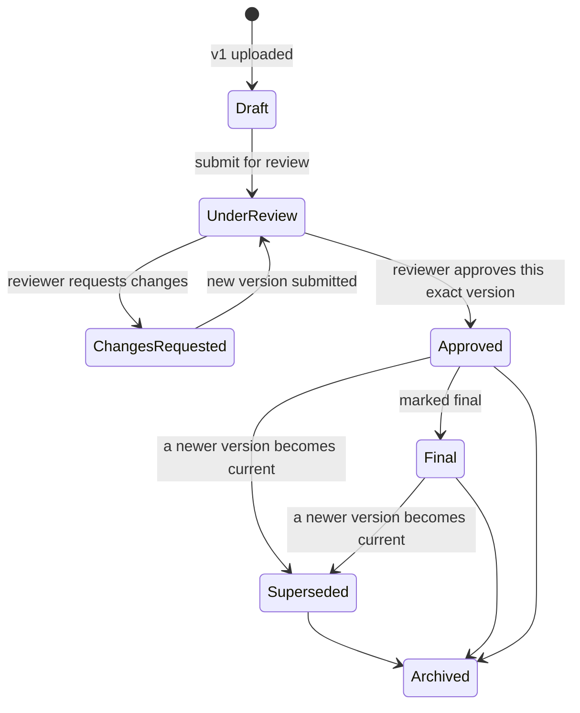

# 06 — Core Flows: Upload, Preview, Download, Versioning

## Upload

### Statuses

`pending → uploading → processing → quarantined → ready`, with `failed`, `rejected`, `archived`
as terminal branches. The status lives on both `uploadSessions.status` and
`fileVersions.processingStatus`; the version row is only created at finalization, so a failed upload
**cannot** leave a usable file record behind (brief §21 test requirement).

### Sequence — single-shot upload

```mermaid
sequenceDiagram
    participant B as Browser
    participant API as Route handlers
    participant S as UploadService
    participant P as Permission
    participant FS as StorageProvider
    participant DB as MongoDB
    participant W as Worker

    B->>API: POST /api/uploads/authorize {folderId, filename, size, mimeType, intent, idempotencyKey}
    API->>API: getActor() → session valid, user active
    API->>P: assertCan(actor, 'file.upload' | 'version.upload', folder|file)
    API->>S: authorize()
    S->>S: sanitize filename · extension allow-list · MIME allow-list · size ≤ MAX_UPLOAD_SIZE
    S->>DB: quota check (user + department + project + org)
    S->>DB: insert uploadSession {status:'pending', quarantineKey, expiresAt}
    S-->>B: 201 {uploadSessionId, uploadUrl:'/api/uploads/{id}/content', chunkSize, expiresAt}

    B->>API: PUT /api/uploads/{id}/content  (binary stream)
    API->>S: receive(actor, id, stream)
    S->>DB: status='uploading'
    S->>FS: saveFile({area:'quarantine', key, body:stream, expectedSize})
    Note over FS: streamed: body → byteCounter → sha256 → disk (flags:'wx')<br/>never buffered in memory; abort+unlink if size exceeded
    FS-->>S: {size, checksumSha256}
    S->>DB: status='quarantined', bytesReceived, checksum
    S-->>B: 200 {status:'quarantined', checksum}

    B->>API: POST /api/uploads/{id}/finalize {displayName?, metadata?, versionNote?}
    API->>S: finalize()
    S->>S: IDEMPOTENCY — if session already 'ready', return existing {fileId,versionId}
    S->>FS: sniff magic bytes → real MIME; reject on declared/real mismatch or deny-list
    S->>S: verify measured size == bytes on disk; verify client checksum if supplied
    S->>DB: withTransaction:
    Note over DB: insert fileVersions(v1 or vN, isCurrent:true, processingStatus:'processing')<br/>insert/update files (currentVersionId, sizes, denormalized mime)<br/>previous version isCurrent:false, label 'superseded'<br/>storageUsage += size · uploadSession.status='ready'<br/>auditLogs.append('file.upload' | 'file.version_upload')
    S->>FS: moveFile(quarantineKey → originals key)   ← rename(2), atomic on the same volume
    S->>DB: fileVersions.processingStatus='ready'
    S->>DB: enqueue jobs: preview.generate, (Phase 11) av.scan
    S-->>B: 201 {file: FileDTO, version: VersionDTO}
    W->>FS: generate preview artifact → previews/{fileId}/{versionId}.pdf|png|txt
    W->>DB: fileVersions.previewStatus='ready', previewKey
```

**Ordering note.** The DB transaction commits *before* the physical move. If the move then fails,
the version stays `processing` and a compensating job either retries the move or marks it `failed` —
the file is never listed as ready while its bytes are missing. The reverse order (move first) would
risk orphaned bytes with no record, which is worse: unreferenced data with no audit trail.

### Chunked / resumable upload (files > 8 MB or on client retry)

```
POST /api/uploads/authorize        → {uploadSessionId, chunkSize: 8MiB, totalChunks}
PUT  /api/uploads/{id}/chunks/{n}  → stream chunk to temporary/{id}/part-000n (flags 'wx')
                                     idempotent: re-PUT of a received chunk is a 200 no-op
GET  /api/uploads/{id}             → {receivedChunks:[…], bytesReceived}  ← resume point
POST /api/uploads/{id}/finalize    → assemble parts in order into quarantine/{id}/assembled,
                                     hashing while concatenating, then the same finalize path
```

Guarantees: chunks are written with exclusive-create; assembly verifies every index is present and
each part's size matches; the assembled size must equal `declaredSize`; partial state is removed by
the TTL sweeper after `INCOMPLETE_UPLOAD_RETENTION_HOURS`. Finalize is idempotent by
`idempotencyKey` **and** by the unique index on `fileVersions.uploadSessionId`, so a duplicate
finalize can never create two versions.

### Rejection paths

| Condition | Result |
|---|---|
| Extension/MIME on deny-list | 415, session `rejected`, quarantine deleted, audit `upload.rejected` |
| Declared MIME ≠ sniffed MIME (e.g. `.pdf` starting with `MZ`) | 415, `rejected`, audit with both values |
| Size > `MAX_UPLOAD_SIZE_MB` or quota exceeded | 413/507, `failed`, quarantine deleted |
| Stream exceeds `expectedSize` mid-flight | connection aborted, partial file unlinked |
| Checksum mismatch vs client-declared | 422, `failed` |
| AV scan positive (Phase 11) | stays in quarantine, `rejected`, admin notified, bytes retained for forensics |

## Preview

```mermaid
sequenceDiagram
    participant B as Browser
    participant API as GET /api/files/{fileId}/preview?versionId=
    participant P as Permission
    participant DB as MongoDB
    participant FS as StorageProvider

    B->>API: request preview
    API->>API: getActor() — 401 if absent/expired/deactivated
    API->>DB: load file (+ folder ancestors) via visibilityFilter
    Note over API: not visible → 404 (never 403 — a 403 confirms existence)
    API->>P: assertCan(actor,'file.preview',file)
    API->>DB: resolve version: requested | currentVersionId; must be 'ready'
    alt generated artifact exists (Office, or rasterized)
        API->>FS: getFile(previewKey)
    else natively previewable (pdf/image/text/csv/json/xml/audio/video)
        API->>FS: getFile(storageKey, {range})
    end
    API-->>B: 200/206 stream + hardened headers
    API->>DB: activities.append('file.preview') + auditLogs.append (sampled/deduped per 5 min)
```

**Preview response headers**

```
Content-Type: <safe, from an allow-list map — never the client-declared value>
Content-Disposition: inline; filename="<sanitized>"; filename*=UTF-8''<encoded>
X-Content-Type-Options: nosniff
Content-Security-Policy: default-src 'none'; sandbox; base-uri 'none'; frame-ancestors 'self'
Cross-Origin-Resource-Policy: same-origin
Cache-Control: private, no-store
Accept-Ranges: bytes            (media only)
```

**Preview matrix**

| Type | Strategy | Renderer |
|---|---|---|
| PDF | stream original | `pdf.js` in a sandboxed iframe (no `eval`, worker from same origin) |
| Images (png/jpg/webp/gif/tiff/bmp) | stream original; TIFF/BMP → PNG artifact | `` |
| SVG | **never inline** — rasterize to PNG artifact, else download only | `` on the artifact |
| Text/MD/code | stream first 2 MB, `text/plain` | syntax-highlighted, escaped |
| CSV/TSV | server parses first 5 000 rows → JSON | TanStack Table |
| JSON/XML/YAML | stream first 2 MB, `text/plain` | collapsible viewer, parsed client-side without `eval` |
| Audio/Video | stream original with Range | `<audio>/<video>` |
| DOCX | worker → PDF artifact (LibreOffice headless) or sanitized HTML (`mammoth`) | pdf.js / sanitized HTML |
| XLSX | worker → sheet JSON artifact (`exceljs`, formulas **not** evaluated) | table viewer |
| PPTX | worker → PDF artifact | pdf.js |
| Everything else | no preview; "Download to view" state | — |

Office rendering runs in the **worker container** with no network, a CPU/memory cap and a timeout —
never in the request path, never with macro execution.

## Download

```mermaid
sequenceDiagram
    participant B as Browser
    participant API as GET /api/files/{fileId}/download?versionId=
    participant P as Permission
    participant DB as MongoDB
    participant FS as StorageProvider

    B->>API: request download
    API->>API: getActor()
    API->>DB: load file via visibilityFilter → 404 if invisible
    API->>P: assertCan(actor,'file.download',file)
    Note over P: Management Viewer has view but NOT download → 403 here
    API->>DB: resolve version (default currentVersionId; approvedVersionId if ?approved=1)
    API->>DB: version.processingStatus must be 'ready'
    API->>FS: fileExists(storageKey) → 500 STORAGE_MISSING + integrity alert if false
    API->>FS: getFile(storageKey, {range})
    API-->>B: 200/206 stream
    API->>DB: audit('file.download') + activity + files.downloadCount++
```

**Download response headers**

```
Content-Type: application/octet-stream          ← always, for downloads
Content-Disposition: attachment; filename="<ascii-fallback>"; filename*=UTF-8''<rfc5987>
Content-Length: <version.fileSize>
X-Content-Type-Options: nosniff
Cache-Control: private, no-store
```

Filename safety: quotes, `\`, CR/LF, `;` and control characters are stripped from the ASCII
fallback (header-injection prevention); the UTF-8 form is percent-encoded per RFC 5987.
The physical key is never in any header or body.

**Bulk download** (folder / multi-select) is an async export job: permission is evaluated
**per file**, silently skipping what the actor cannot see; the ZIP is written to
`exports/{userId}/{jobId}.zip`, downloadable once, and deleted after 24 h. The job's manifest is audited.

## Versioning



### Invariants (enforced by partial unique indexes + service guards)

1. A version's bytes are **never** overwritten — `saveFile` uses exclusive create and each version
   gets a fresh UUID key.
2. `isCurrent: true` on at most one version per file (unique partial index).
3. `isApproved: true` on at most one version per file (unique partial index).
4. Once `processingStatus === 'ready'`, only status/label/flag/preview fields may change.
5. Once approved, the file is `isLocked` — rename/metadata/replace on the *approved version* is
   refused with `FILE_LOCKED_APPROVED`. Uploading a **new version** stays allowed; that is the
   prescribed way to change an approved document.
6. Restoring an old version creates a **new** version (`versionNumber = max+1`,
   `restoredFromVersionId` set, same bytes referenced through a fresh key via `copyFile`) — history
   is never rewritten.

### New-version sequence

```
POST /api/files/{id}/versions  (authorize → same upload pipeline with intent='new_version')
finalize (transaction):
   newVersion.versionNumber = file.versionCount + 1
   newVersion.isCurrent = true,  previous.isCurrent = false, previous.versionLabel='superseded'
   file.currentVersionId = newVersion._id ; file.versionCount++ ; file.updatedAt = now
   file.reviewStatus = 'draft' ; file.approvalStatus = 'none'   ← a new version is unapproved
   file.approvedVersionId is LEFT UNCHANGED                     ← "latest approved" stays resolvable
   audit('file.version_upload', {previous: vN-1, new: vN})
```

The UI therefore always answers both questions the business asked for: *what is the latest?*
(`currentVersionId`) and *what is the latest approved?* (`approvedVersionId`), with a visible badge
when they differ.

### Restore sequence

```
POST /api/files/{id}/versions/{versionId}/restore {note}
  assertCan(actor,'version.upload',file)
  transaction:
    copyFile(old.storageKey → new key with new versionId)      ← bytes duplicated, old key untouched
    insert fileVersions {versionNumber: max+1, isCurrent:true, restoredFromVersionId: versionId,
                         checksum: old.checksum, versionLabel:'draft'}
    previous current → isCurrent:false, 'superseded'
    file.currentVersionId = new._id ; reviewStatus='draft' ; approvalStatus='none'
    audit('file.version_restore', {restoredFrom: versionNumber})
```

Copying bytes rather than re-pointing keeps rule 2 in [04](./04-storage.md) — one version, one key —
so deleting any single version can never damage another.

### Approval sequence

```
POST /api/files/{id}/review        → creates review {versionId: currentVersionId} , file.reviewStatus='submitted'
POST /api/reviews/{id}/decision    → assertCan('review.approve'), assert reviewer ≠ uploader,
                                     assert review.versionId === file.currentVersionId
                                       (else 409 VERSION_MOVED — you must review what you were shown)
   transaction:
     reviews.decisions.push({reviewerId, decision, note, decidedAt, ip, userAgent})
     if approved and decisions ≥ requiredApprovals:
        previous approved version → isApproved:false, label 'superseded'
        thisVersion.isApproved = true, versionLabel='approved'
        file.approvedVersionId = versionId ; approvalStatus='approved' ; isLocked=true
     audit('file.approve' | 'file.reject', {versionId, reviewId, note})
   notify: requester + file owner + project lead
```
