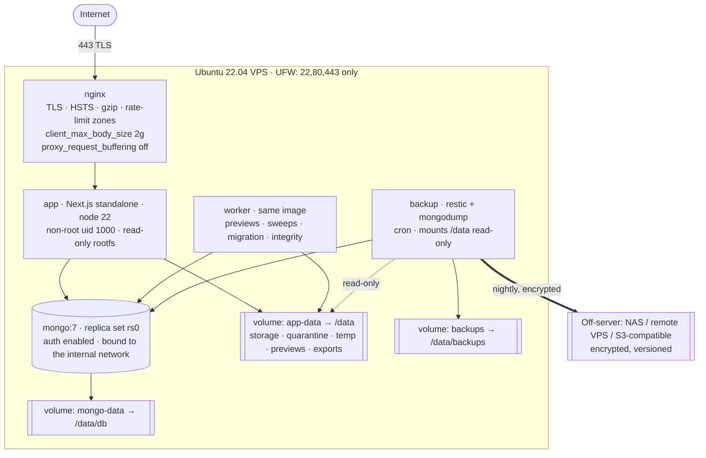

# 09 — Deployment, Docker Strategy & Backup Architecture

## Why not serverless

The application holds open file handles, streams multi-GB bodies, runs background jobs, and reads
from a persistent local disk. Vercel/Netlify function filesystems are ephemeral and per-invocation —
uploaded files would vanish on redeploy. Target: **Ubuntu VPS + Docker Compose + persistent volume**.
(After a future S3/MinIO provider swap, managed hosting becomes viable; not before.)

## Production topology



Only `nginx` publishes ports. `app`, `worker`, `mongo`, `backup` sit on an internal bridge network
with no host port mapping.

## Compose strategy

One base file plus per-environment overrides — no duplicated service definitions.

| File | Role |
|---|---|
| `docker-compose.yml` | Base: service graph, volumes, networks, healthchecks |
| `docker-compose.dev.yml` | Bind-mounts the source, `next dev`, exposes Mongo on 27017 for Compass, dev Nginx on :8080 |
| `docker-compose.prod.yml` | Built image, `restart: unless-stopped`, resource limits, read-only rootfs, TLS Nginx, backup service |
| `.env` / `.env.staging` / `.env.production` | Per-environment config; **separate databases and separate storage roots per environment** |

```bash
# development
docker compose -f docker-compose.yml -f docker-compose.dev.yml up
# production
docker compose -f docker-compose.yml -f docker-compose.prod.yml --env-file .env.production up -d
```

### Base services

| Service | Image | Key settings |
|---|---|---|
| `mongo` | `mongo:7` | `--replSet rs0 --auth --keyFile`; init container runs `rs.initiate()` once; healthcheck `db.adminCommand('ping')`; volume `mongo-data` |
| `app` | built (multi-stage) | `NODE_ENV`, env-file, volume `app-data:/data`, healthcheck `GET /api/health/ready`, `depends_on: mongo (healthy)`, user `1000:1000` |
| `worker` | same image, `node worker.js` | same volume + env; no exposed port; no network egress in prod except Mongo |
| `nginx` | `nginx:alpine` | 80/443, config + certs mounted read-only, `depends_on: app` |
| `backup` | `alpine` + `restic` + `mongodb-tools` | cron; `app-data:ro`, `backups:rw`; env holds the repo URL + password |

### Dockerfile (multi-stage, standalone)

```dockerfile
FROM node:22-alpine AS deps      # npm ci --omit=dev for the runtime layer
FROM node:22-alpine AS builder   # full deps, next build → .next/standalone
FROM node:22-alpine AS runner
ENV NODE_ENV=production
RUN addgroup -g 1000 nodejs && adduser -u 1000 -G nodejs -s /bin/sh -D nextjs
COPY --from=builder --chown=nextjs:nodejs /app/.next/standalone ./
COPY --from=builder --chown=nextjs:nodejs /app/.next/static ./.next/static
COPY --from=builder --chown=nextjs:nodejs /app/public ./public
USER nextjs
EXPOSE 3000
HEALTHCHECK CMD node -e "fetch('http://127.0.0.1:3000/api/health').then(r=>process.exit(r.ok?0:1))"
CMD ["node","server.js"]
```

`next.config.ts` sets `output: 'standalone'`. `.dockerignore` excludes `node_modules`, `.next`,
`.env*`, `docs`, `tests`. Images are tagged with the git SHA; deploys are `pull && up -d` with
`--no-deps` per service so Mongo is never restarted for an app deploy.

### Nginx essentials

```nginx
client_max_body_size 2g;            # must be ≥ MAX_UPLOAD_SIZE_MB
proxy_request_buffering off;        # stream uploads straight through — no disk buffering in nginx
proxy_read_timeout 3600s; proxy_send_timeout 3600s;
proxy_buffering off;                # for download/preview streaming and Range requests
limit_req_zone $binary_remote_addr zone=login:10m rate=10r/m;
limit_req_zone $binary_remote_addr zone=api:10m   rate=120r/m;
# NO location serving /data — ever.
```
TLS via Let's Encrypt (certbot in a sidecar or on the host), TLS 1.2+, modern cipher suite, OCSP stapling.

## Environments

| | Development | Staging | Production |
|---|---|---|---|
| Database | `biotech_drive_dev` | `biotech_drive_staging` | `biotech_drive` |
| Storage root | `./.data/dev` | `/var/lib/biotech-drive-staging` | `/var/lib/biotech-drive` |
| Auth | password login + seeded users | full OAuth, test tenant | full OAuth |
| Data | synthetic seed only | anonymized subset | real |
| Backups | none | weekly | daily + weekly, off-server |

Separate roots and databases are a hard rule — a staging purge job must never be able to reach
production bytes.

## Backup architecture

### Objectives

| Metric | Target |
|---|---|
| RPO (max data loss) | ≤ 24 h for files, ≤ 24 h for metadata (≤ 1 h optional with Mongo oplog snapshots) |
| RTO (time to restore service) | ≤ 4 h |
| Retention | 30 daily, 8 weekly, 12 monthly (`BACKUP_RETENTION_DAYS` drives the daily tier) |
| Off-server copies | ≥ 1, always |
| Verification | Every backup verified; a full restore drill quarterly |

### Schedule

| When | What | How |
|---|---|---|
| 01:00 daily | MongoDB logical dump | `mongodump --gzip --archive` → `backups/mongo/YYYY-MM-DD.gz` |
| 02:00 daily | File incremental | `restic backup /data/storage` (dedup + encrypted + snapshot) |
| Sun 03:00 | Full verification | `restic check --read-data-subset=10%` + `mongorestore --dryRun` |
| 03:30 daily | Off-server sync | `restic` second repo / `rclone` to NAS·remote VPS·S3-compatible |
| 04:00 daily | Retention prune | `restic forget --keep-daily 30 --keep-weekly 8 --keep-monthly 12 --prune` |
| Weekly | Checksum sweep | Re-hash a rolling sample of versions vs `fileVersions.checksum` |
| Quarterly | **Restore drill** | Restore into a scratch stack, run the verification script, record the result |

### Encryption & keys

`restic` encrypts at rest (AES-256) with a repository password stored in the host secret store, not
in the repo. Mongo dumps are encrypted by being written **into** the restic repo, not left as plain
`.gz`. Off-server targets receive only encrypted repository data — the remote never holds plaintext.

### What is backed up

| Included | Excluded |
|---|---|
| `storage/originals`, `versions`, `archives` | `quarantine/`, `temporary/` (transient, and possibly hostile) |
| `previews/` (optional — regenerable; excluded by default to save space) | `exports/` (regenerable, 24 h lifetime) |
| MongoDB (all collections, incl. `auditLogs`) | container images (rebuildable from git) |
| `.env.production` (separately, to the secret store) | `node_modules` |

### Restore procedure (documented and rehearsed — `docs/runbooks/restore.md` in Phase 11)

```
1. Provision host, install Docker, clone repo, restore .env.production from the secret store.
2. restic restore latest --target /var/lib/biotech-drive          # files first
3. docker compose up -d mongo && wait healthy
4. mongorestore --gzip --archive=<dump> --drop
5. docker compose up -d app worker nginx
6. Run scripts/verify-storage-integrity.ts:
     - every fileVersions.storageKey exists on disk
     - re-hash a sample; compare to checksum
     - report orphaned keys
7. Smoke: login → open a known file → download → compare checksum to the pre-incident value.
8. Record RTO achieved, gaps found; file follow-ups.
```

**Consistency note.** File bytes and Mongo metadata are backed up by two mechanisms at different
times, so a restore can land metadata that references bytes not yet in the file snapshot (and vice
versa). This is expected and safe because versions are immutable and never overwritten: the
integrity script reports `MISSING_BYTES` rows, and each is resolvable from the next file snapshot.
Restoring **files first, metadata second** minimizes the window.

### Monitoring & alerts (Phase 11)

- Disk usage > 75 % warn / > 90 % critical (uploads rejected below a configured free-space floor).
- Backup job failed, or no successful backup in 36 h → alert.
- Off-server sync stale > 48 h → alert.
- Checksum mismatch or missing bytes → immediate alert + audit row.
- `/api/health/ready` failing → container restart, then alert.
- Mongo replica-set health, connection-pool saturation, slow-query log (>200 ms).

## CI/CD (Phase 11)

```
push → lint · typecheck · unit · integration (mongodb-memory-server) · security suite
     → build image (tag = git SHA) → push to registry
     → deploy staging → e2e (Playwright) + a11y (axe)
     → manual approval → deploy production (pull, up -d, healthcheck gate, auto-rollback on failure)
```
Secrets live in the CI secret store; `gitleaks` runs on every push; no `.env` file is ever committed.
