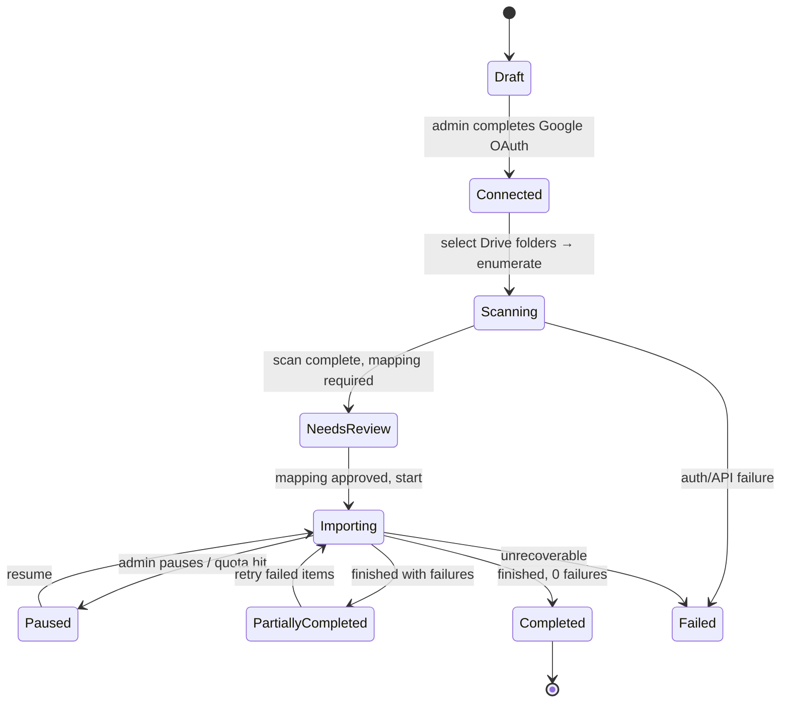

# 10 — Google Drive Migration Strategy

**Prime directive: the migration is strictly read-only against Google Drive.** No file, folder,
permission or timestamp in Drive is ever modified or deleted by this system. The only Drive scope
requested is `drive.readonly` (plus `drive.metadata.readonly`). Deletion of Drive content — if the
company chooses it — is a manual human action after verification.

## Phases of a migration job



## Data model

```
migrationJobs {
  organizationId, name, createdBy, status,           // the states above
  googleAccountEmail, driveType:'my_drive'|'shared_drive', sharedDriveId?,
  sourceFolderIds[], includeSubfolders,
  mapping: {
    targetDriveType:'department'|'project',
    departmentId?, projectId?, targetRootFolderId,
    folderMap: [{ driveFolderId, driveFolderPath, targetFolderId?, createIfMissing:true,
                  departmentId?, projectId?, defaultCategory?, confidentiality? }],
    defaultMetadata: { category?, tags[], confidentiality, ownerStrategy:'drive_owner'|'fixed_user' },
    ownerFallbackUserId
  },
  options: { skipDuplicates:true, duplicateStrategy:'skip'|'new_version'|'import_anyway',
             preserveTimestamps:true, exportGoogleDocsAs:'pdf'|'docx'|'both'|'skip',
             maxFileSizeBytes, concurrency:4, dryRun:false },
  totals: { scanned, eligible, imported, skipped, duplicates, failed, bytesImported },
  scanStartedAt, importStartedAt, completedAt, lastError, cursor
}

migrationItems {
  migrationJobId, driveFileId (unique per job), driveParentId, drivePath,
  name, mimeType, sizeBytes, driveMd5Checksum, driveCreatedTime, driveModifiedTime,
  driveOwnerEmail, driveWebViewLink, isGoogleNativeDoc, exportMimeType,
  status: 'pending'|'downloading'|'staged'|'importing'|'imported'|'skipped'|'duplicate'|'failed',
  targetFolderId?, resultFileId?, resultVersionId?,
  localChecksum?, attempts, lastError, startedAt, finishedAt
}
```

Indexes: `{migrationJobId:1, status:1}`, `{migrationJobId:1, driveFileId:1}` unique,
`{driveFileId:1, organizationId:1}`, `{status:1, attempts:1}` (retry queue).
`files.sourceDriveId` carries a sparse unique index — the ultimate idempotency guard.

## Pipeline

### 1. Connect
Admin-only OAuth (`drive.readonly`, offline access). The refresh token is encrypted at rest with
`AUTH_SECRET`-derived key material and is usable only by migration jobs. Connecting is audited.

### 2. Scan (read-only)
`files.list` with `q='<parent> in parents and trashed=false'`, paginated, fields limited to what the
item model needs, recursing depth-first with a cycle guard (Drive allows multi-parenting; each
`driveFileId` is recorded once per job). Produces `migrationItems` and a **preview report**:
file count, total bytes, type histogram, folder tree, Google-native doc count, oversize files,
blocked extensions, and detected duplicates. Nothing is imported yet.

### 3. Map
Admin maps Drive folders → target department/project/folder, sets default category, confidentiality,
tags and owner strategy. Owner mapping: `driveOwnerEmail` → local user by email; unmatched owners
fall back to `ownerFallbackUserId` and are flagged in the report. The default folder template can be
applied to the target so imported content lands inside `01_…`–`12_…` rather than a flat dump.

### 4. Import (batched, resumable)
Per item, with `options.concurrency` workers:

```
1. claim item (findOneAndUpdate status pending→downloading, lease)
2. skip rules: blocked extension · size > limit · Google-native and exportGoogleDocsAs='skip'
3. download:
     binary       → files.get?alt=media          (streamed)
     Google-native→ files.export (Docs→PDF/DOCX, Sheets→XLSX, Slides→PDF)
   → StorageProvider.saveFile({area:'migration-staging'}) — streaming, SHA-256 while writing
4. verify: bytes received == Drive size (binary only); compare driveMd5Checksum when present
5. duplicate detection, in order:
     a. files.sourceDriveId == driveFileId                 → already imported → 'duplicate'/skip
     b. same checksum + same target folder                 → per duplicateStrategy
     c. same checksum elsewhere in the org                 → import, link as related, flag in report
6. ensure target folder chain exists (create from folderMap, preserving Drive hierarchy)
7. transaction:
     insert files {…, sourceDriveId, migrationJobId, createdAt: driveCreatedTime (if preserveTimestamps),
                   ownerId: mappedOwner, category/confidentiality/tags from mapping}
     insert fileVersions {versionNumber:1, checksum, isCurrent:true, processingStatus:'ready',
                          originalFilename: drive name, uploadedAt: driveModifiedTime}
     storageUsage += size ; migrationItems.status='imported'
     auditLogs.append('migration.import_item', {driveFileId, drivePath, fileId, checksum})
8. moveFile(staging key → originals key)
9. enqueue preview generation
```

Failure marks the item `failed` with `lastError` and increments `attempts`; the job continues.
Transient Google errors (`403 rateLimitExceeded`, `429`, `5xx`) retry with exponential backoff and
respect `Retry-After`; they do not count toward `attempts`.

### 5. Pause / resume / retry
Pause sets the job status; in-flight items finish and workers stop claiming. Resume re-claims
`pending`. `retry-failed` resets `failed` items to `pending` (attempts preserved for the report).
Because every item is keyed by `driveFileId` and `files.sourceDriveId` is uniquely indexed, resuming
can never double-import — even after a crash mid-transaction.

### 6. Review & report
Report (viewable + CSV export): totals, per-folder breakdown, skipped with reasons, duplicates with
both locations, failures with errors, unmapped owners, oversize/blocked files, bytes imported,
elapsed time, and a **verification section** — a random 5 % sample re-hashed from disk and compared
to the recorded checksum. Imported files land with `reviewStatus:'draft'`; an admin can bulk-assign
project/experiment metadata from the review screen.

## What is preserved

| Drive attribute | Preserved as | Notes |
|---|---|---|
| Folder hierarchy | Recreated `folders` tree under the mapped root | Multi-parented files are imported once, into their first-seen parent, and noted in the report |
| Filename | `originalFilename` + `displayName` | Physical name is still a UUID |
| Created / modified time | `files.createdAt`, `fileVersions.uploadedAt` | Only with `preserveTimestamps` |
| Owner | `ownerId` via email match | Fallback user + report flag |
| Drive file id | `files.sourceDriveId`, `migrationItems.driveFileId` | Idempotency + provenance |
| Drive link | `migrationItems.driveWebViewLink` | Traceability back to the source |
| MD5 (when Drive supplies it) | Compared to the local SHA-256 pipeline's byte count and stored | Drive does not expose MD5 for native docs |
| Drive permissions | **Not** imported | Drive ACLs are the problem being replaced; access is re-established from departments/projects/roles. This is a deliberate decision, called out to admins in the UI. |
| Comments, revisions, starred | Not imported in the MVP | Revision import is a possible later addition |

## Safety rails

1. Scopes are read-only; no write/delete scope is ever requested — the app *cannot* modify Drive.
2. `dryRun` performs everything except the download and the writes.
3. A hard cap on job bytes vs free disk space; the job refuses to start if it would breach the floor.
4. Rate limiting and backoff keep the company's Drive API quota intact.
5. Every item transition is audited; the job itself is audited on create/start/pause/resume/cancel.
6. Blocked extensions are never written to `originals/` — they stay in the report as skipped.
7. Imports never overwrite an existing file; the worst case is an extra version or a skipped item.
8. Post-migration, the admin verification checklist (counts + sampled checksums + spot-open) must
   pass **before** anyone considers touching the Drive originals.
